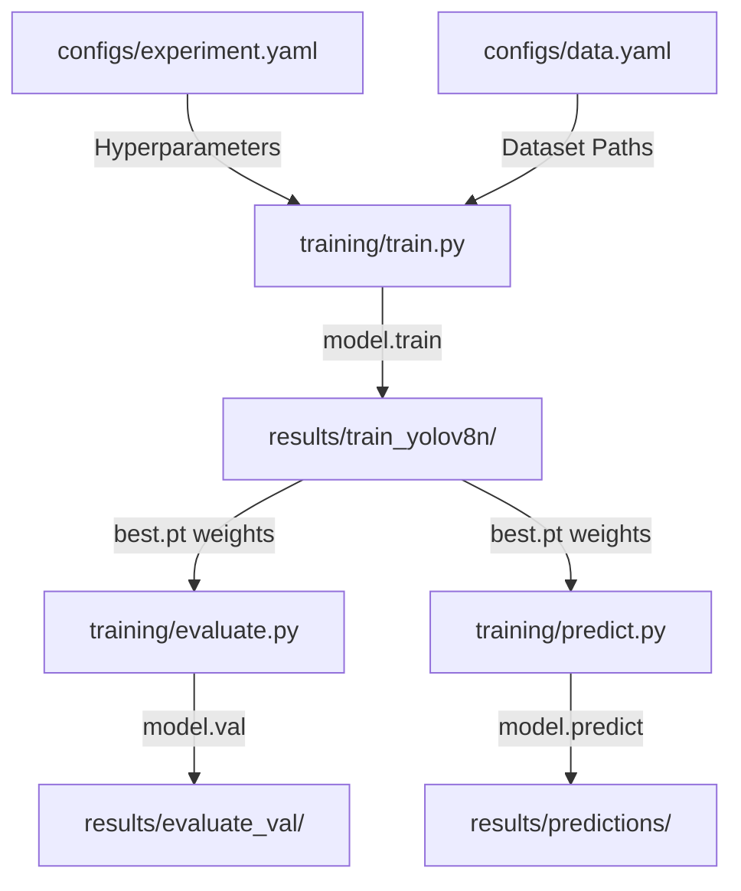

# Week 1 Milestone Summary: Environment & Training Infrastructure

This document summarizes the progress, implementations, and design decisions completed during Week 1 of the **Real-Time Industrial Defect Detection System** project.

---

## 📅 Daily Progress Overview

* **Day 1: Repository Structure & Core Modules**
  * Established project folder structure layout (`dataset/yolo`, `training/`, `configs/`, `utils/`, `tests/`, `results/`).
  * Configured shared Python utilities: [utils/logger.py](file:///c:/Users/druva/projects/Real-Time-Industrial-Defect-Detection-System/utils/logger.py) for structured stream/file logs and [utils/device.py](file:///c:/Users/druva/projects/Real-Time-Industrial-Defect-Detection-System/utils/device.py) for CPU/CUDA device management.
  * Added Project Config settings mapping in [utils/config.py](file:///c:/Users/druva/projects/Real-Time-Industrial-Defect-Detection-System/utils/config.py).
* **Day 2: Configurations & Environment Setup**
  * Set up experiment overrides in [configs/experiment.yaml](file:///c:/Users/druva/projects/Real-Time-Industrial-Defect-Detection-System/configs/experiment.yaml).
  * Validated installation of PyTorch, Ultralytics YOLOv8, and OpenCV inside the project virtual environment.
* **Day 3: Pipeline Skeletons & Visualizer**
  * Created Pascal VOC XML annotation parsing and drawing overlays in [utils/visualization.py](file:///c:/Users/druva/projects/Real-Time-Industrial-Defect-Detection-System/utils/visualization.py) to check dataset annotations.
  * Created CLI skeletons for model training ([training/train.py](file:///c:/Users/druva/projects/Real-Time-Industrial-Defect-Detection-System/training/train.py)), prediction ([training/predict.py](file:///c:/Users/druva/projects/Real-Time-Industrial-Defect-Detection-System/training/predict.py)), and evaluation ([training/evaluate.py](file:///c:/Users/druva/projects/Real-Time-Industrial-Defect-Detection-System/training/evaluate.py)).
* **Day 4: YOLOv8 Training Loop Integration**
  * Implemented the model training flow inside [train.py](file:///c:/Users/druva/projects/Real-Time-Industrial-Defect-Detection-System/training/train.py) with hyperparameters overrides and experiment directory logging under `results/`.
  * Added a `--dry-run` parameter to execute a fast 1-epoch test loop on CPU with small image sizes.
* **Day 5: Dry-Run Testing, Skeletons Expansion, and Project Cleanup**
  * Expanded prediction skeleton ([predict.py](file:///c:/Users/druva/projects/Real-Time-Industrial-Defect-Detection-System/training/predict.py)) to run model inference and save outputs with class labels to `results/predictions/`.
  * Expanded evaluation skeleton ([evaluate.py](file:///c:/Users/druva/projects/Real-Time-Industrial-Defect-Detection-System/training/evaluate.py)) to run `model.val()` and log mAP performance metrics.
  * Created an orchestration script ([scripts/run_dry_run_pipeline.py](file:///c:/Users/druva/projects/Real-Time-Industrial-Defect-Detection-System/scripts/run_dry_run_pipeline.py)) to run the entire flow sequentially.

---

## 🏗️ Architecture & Component Design

---

## 🧪 Testing and Verification Results

* **Unit Test Coverage**: Automated test suites are written and execute successfully:
  * [tests/test_visualization.py](file:///c:/Users/druva/projects/Real-Time-Industrial-Defect-Detection-System/tests/test_visualization.py): Checks VOC XML parse accuracy and overlays.
  * [tests/test_skeletons.py](file:///c:/Users/druva/projects/Real-Time-Industrial-Defect-Detection-System/tests/test_skeletons.py): Checks argument parser configuration overrides.
  * [tests/test_train_pipeline.py](file:///c:/Users/druva/projects/Real-Time-Industrial-Defect-Detection-System/tests/test_train_pipeline.py): Verifies dry-run model training executes and saves weights.
  * [tests/test_inference_pipeline.py](file:///c:/Users/druva/projects/Real-Time-Industrial-Defect-Detection-System/tests/test_inference_pipeline.py): Verifies prediction and evaluation script loops.

---

## 🤝 Teammate Integrations Completed
* **Data Engineer (Saniya)**: Successfully split raw NEU metal surface defect images into YOLO formatted directories (`dataset/yolo/{train,val,test}`) and output [configs/data.yaml](file:///c:/Users/druva/projects/Real-Time-Industrial-Defect-Detection-System/configs/data.yaml).
* **Backend Engineer (Prajwal)**: Set up FastAPI server endpoints and base wrappers in `backend/` for model prediction integration.
