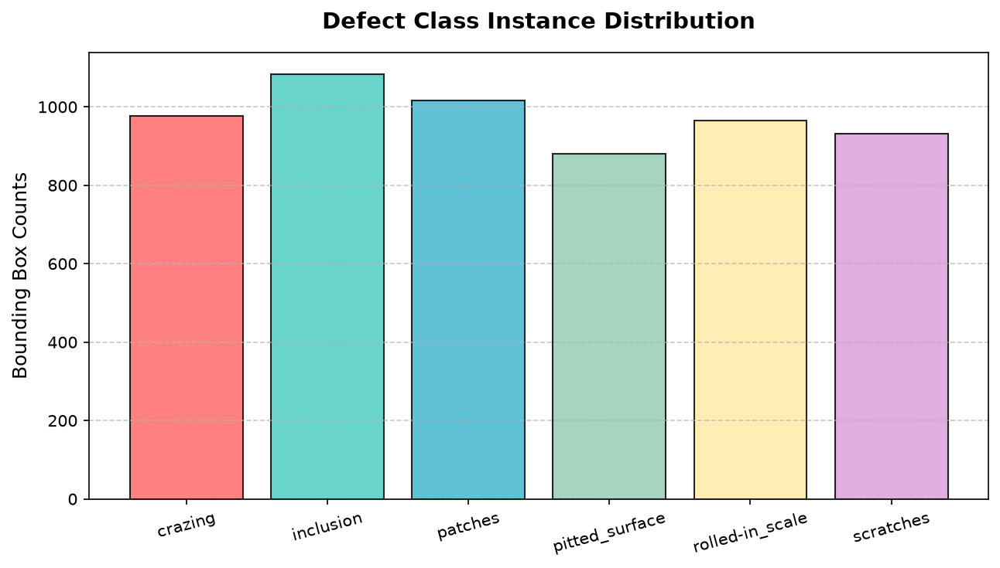
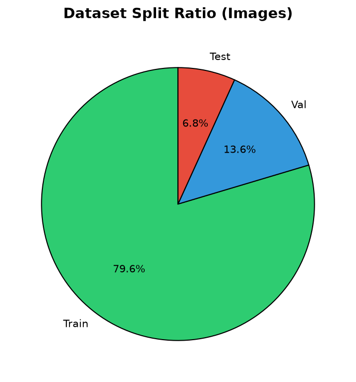
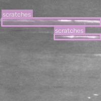
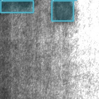
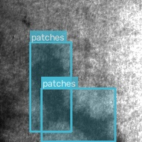
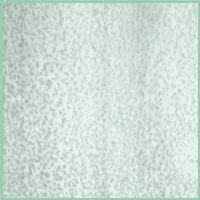
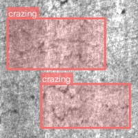
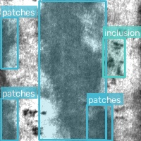

# Dataset Analytics & Visualisation Dashboard

This dashboard displays comprehensive visual and numerical analytics computed on the dataset splits.

## 1. Overall Dataset Metrics Summary

- **Total Image Count**: 2649
- **Total Label Files**: 2649
- **Total Bounding Box Instances**: 5853
- **Mean Defect Instances per Image**: 2.21

## 2. Bounding Box Geometric Analysis

- **Average Bounding Box Width**: 0.4049 (relative to image width)
- **Average Bounding Box Height**: 0.5035 (relative to image height)
- **Average Aspect Ratio (W/H)**: 1.18
- **Standard Deviation (Width/Height)**: 0.2787 / 0.2886

## 3. Dataset Splits Distribution

| Split | Image Count | Label Count | Total Annotations | Density (Bboxes/Img) |
| --- | --- | --- | --- | --- |
| Train | 2109 | 2109 | 4580 | 2.17 |
| Val | 360 | 360 | 832 | 2.31 |
| Test | 180 | 180 | 441 | 2.45 |

## 4. Class Distribution & Representation Analysis

| Class ID | Class Name | Total Instances | Percentage (%) | Images Containing Class | Representation Type |
| --- | --- | --- | --- | --- | --- |
| 0 | crazing | 976 | 16.68% | 423 | Robust |
| 1 | inclusion | 1084 | 18.52% | 430 | Robust |
| 2 | patches | 1017 | 17.38% | 412 | Robust |
| 3 | pitted_surface | 880 | 15.04% | 618 | Robust |
| 4 | rolled-in_scale | 965 | 16.49% | 463 | Robust |
| 5 | scratches | 931 | 15.91% | 504 | Robust |

## 5. Visualizations & Distributions

### Defect Class Instance Distribution

### Dataset Split Ratio

## 6. Sample Ground-Truth Bounding Box Overlays

### Split: TRAIN (sample_train_aug_scratches_268_80.jpg)

### Split: TRAIN (sample_train_patches_163.jpg)

### Split: VAL (sample_val_patches_263.jpg)

### Split: VAL (sample_val_pitted_surface_17.jpg)

### Split: TEST (sample_test_crazing_281.jpg)

### Split: TEST (sample_test_patches_230.jpg)

---
Dashboard report created automatically by `generate_dataset_dashboard.py`.