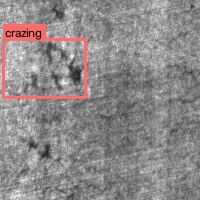
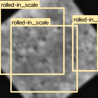
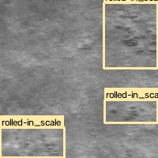
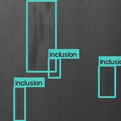
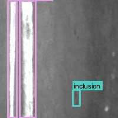
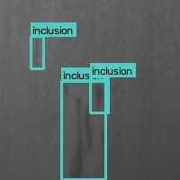

# Dataset Analytics & Visualisation Dashboard

This dashboard displays comprehensive visual and numerical analytics computed on the dataset splits.

## 1. Overall Dataset Metrics Summary

- **Total Image Count**: 2755
- **Total Label Files**: 2755
- **Total Bounding Box Instances**: 6090
- **Mean Defect Instances per Image**: 2.21

## 2. Bounding Box Geometric Analysis

- **Average Bounding Box Width**: 0.4042 (relative to image width)
- **Average Bounding Box Height**: 0.5028 (relative to image height)
- **Average Aspect Ratio (W/H)**: 1.17
- **Standard Deviation (Width/Height)**: 0.2793 / 0.2884

## 3. Dataset Splits Distribution

| Split | Image Count | Label Count | Total Annotations | Density (Bboxes/Img) |
| --- | --- | --- | --- | --- |
| Train | 2215 | 2215 | 4817 | 2.17 |
| Val | 360 | 360 | 832 | 2.31 |
| Test | 180 | 180 | 441 | 2.45 |

## 4. Class Distribution & Representation Analysis

| Class ID | Class Name | Total Instances | Percentage (%) | Images Containing Class | Representation Type |
| --- | --- | --- | --- | --- | --- |
| 0 | crazing | 979 | 16.08% | 424 | Robust |
| 1 | inclusion | 1131 | 18.57% | 456 | Robust |
| 2 | patches | 1115 | 18.31% | 457 | Robust |
| 3 | pitted_surface | 939 | 15.42% | 665 | Robust |
| 4 | rolled-in_scale | 975 | 16.01% | 470 | Robust |
| 5 | scratches | 951 | 15.62% | 513 | Robust |

## 5. Visualizations & Distributions

### Defect Class Instance Distribution

### Dataset Split Ratio

## 6. Sample Ground-Truth Bounding Box Overlays

### Split: TRAIN (sample_train_crazing_148.jpg)

### Split: TRAIN (sample_train_aug_rolled-in_scale_192_2.jpg)

### Split: VAL (sample_val_rolled-in_scale_51.jpg)

### Split: VAL (sample_val_inclusion_129.jpg)

### Split: TEST (sample_test_scratches_143.jpg)

### Split: TEST (sample_test_inclusion_127.jpg)

---
Dashboard report created automatically by `generate_dataset_dashboard.py`.