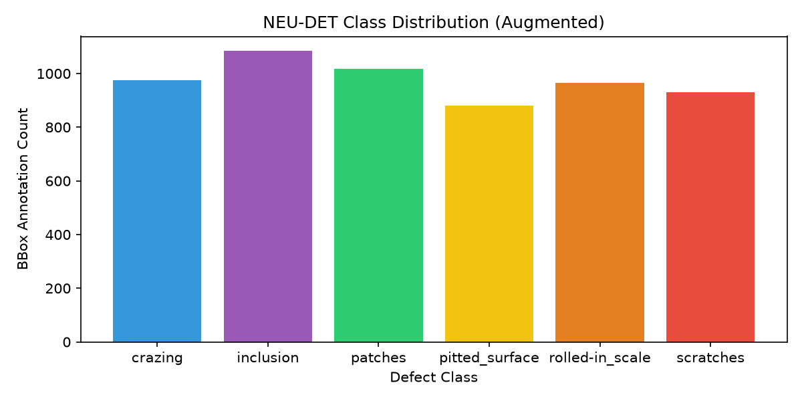

# Dataset Quality Scoring and Benchmarking Report

Generated dynamically by `dataset_quality_score.py`.

## 🏆 Overall Dataset Quality Score
**Composite Quality Index**: `79.96 / 100.0`

## 📊 Quality Scoring Component Details
| Quality Dimension | Value / Statistic | Calculated Sub-score | Weight in Index |
| --- | --- | --- | --- |
| **Image Resolution Sanity** | 200.0x200.0 mean dimension | 25.0 / 25.0 | 25% |
| **Defect Blur Indicator** | 773.5 average Laplacian variance | 25.0 / 25.0 | 25% |
| **Shannon Class Balance** | 2.582 entropy (Perfect is 2.585) | 30.0 / 30.0 | 30% |
| **Annotation Integrity** | 0.00% error rate | Penalty: -0.0 | Penalty (up to -20) |

## 📐 Annotation Coverage Statistics
- **Total Bounding Boxes Checked**: 5853
- **Average Box Coverage (Box area / Image area)**: 21.87%
- **Median Box Coverage**: 13.87% if box_areas else 0.0

## 📦 Resolution and Volume Distribution
- **Total Images Analyzed**: 2649
- **Class Counts**:
  - **crazing**: 976 annotations
  - **inclusion**: 1084 annotations
  - **patches**: 1017 annotations
  - **pitted_surface**: 880 annotations
  - **rolled-in_scale**: 965 annotations
  - **scratches**: 931 annotations

